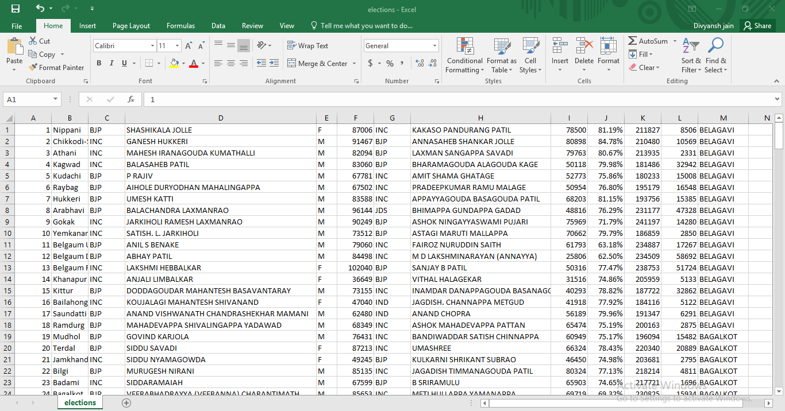
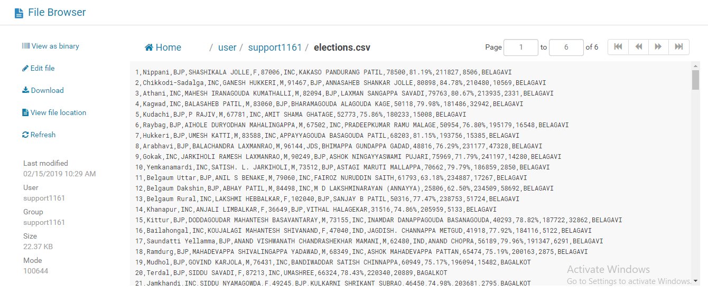
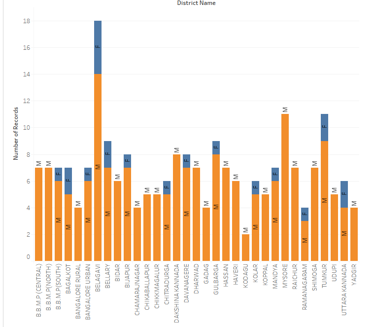
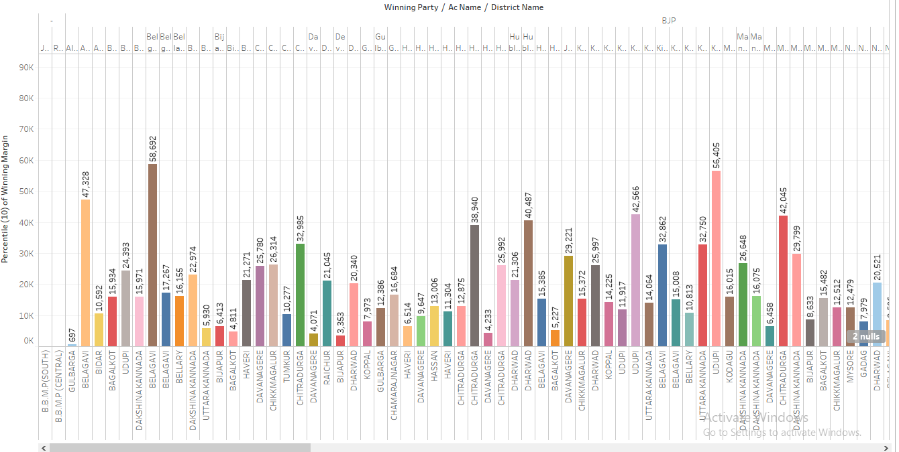
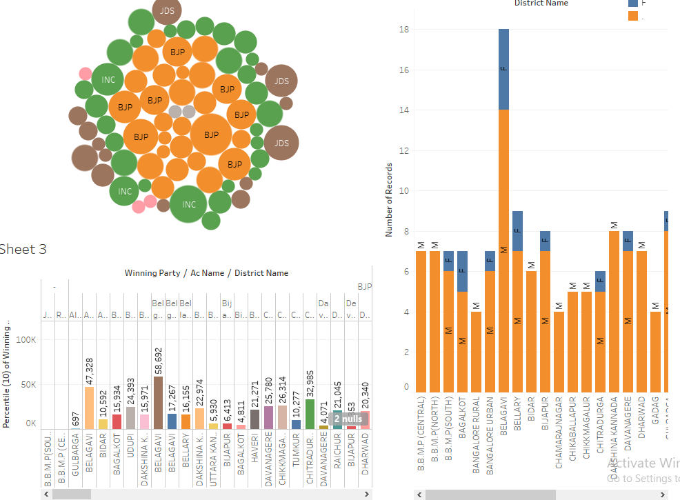

# Election Analysis

****************************************************************************************

## Objective

To analyse elections data & display it on the dashboard

## Data Description

Dataset contains csv files consists of diifernt columns of elections data.

## Tools & Technologies Used

Best suited technologies:

 1. Hadoop

 2. Apache Hive

 3. Tableau (Visualisation) 

## Cloudxlab Details

** WebConsole Login Credentials **

Username: support1161

Password : **********

----------------------------------------------------------------------------------------------------------------------------------------------
----------------------------------------------------------------------------------------------------------------------------------------------

## Hadoop

Data is present in HDFS i.e Elections.csv 

## Problem Statements

Problem Statement 1: To find the gender of the winning candidate & also to display the name of the district to which the candidate won?

Problem Statement 2: To find the winning party in each district from the dataset?

Problem Statement 3: To display the winning party whose voting percentage gets out to be more than 60%?

Problem Statement 4: To display the winning margin of runner up party and winning party & display the name of winning & runner up parties?

** CREATE HIVE TABLE **
***************************

        create table election(ac_no int, ac_name string, winning_party string, winning_candidate string, gender string, winner_votes string, runner_up_party string, runner_up_candidate string, runner_up_votes string, voting_turnout_perc string, total_voters string, winning_margin string, district_name string) row format delimited fields terminated by ',';

----------------------------------------------

** LOADING DATA IN HIVE TABLE **
***************************

        load data inpath 'elections.csv';

----------------------------------------------

## Case 1: To find the gender of the winning candidate & also to display the name of the district to which the candidate won?

## Case 2: To find the winning party in each district from the dataset?

## Case 3: To display the winning party whose voting percentage gets out to be more than 60%?

## Case 4: To display the winning margin of runner up party and winning party & display the name of winning & runner up parties?

** DASHBOARD **
*****************

